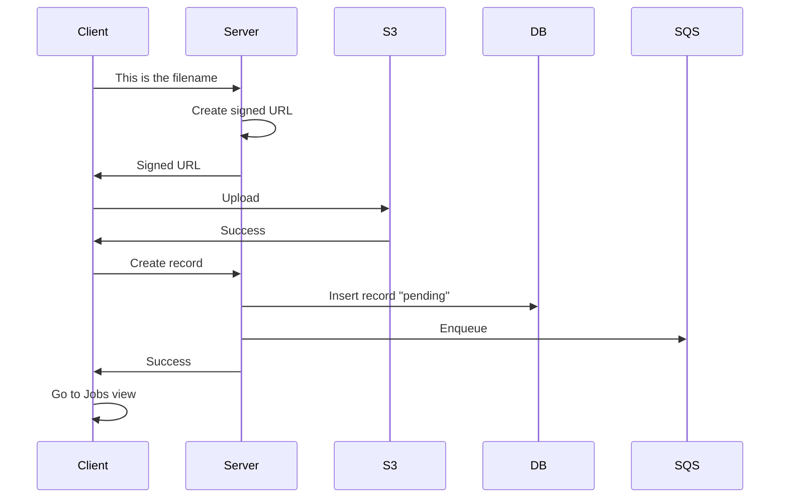
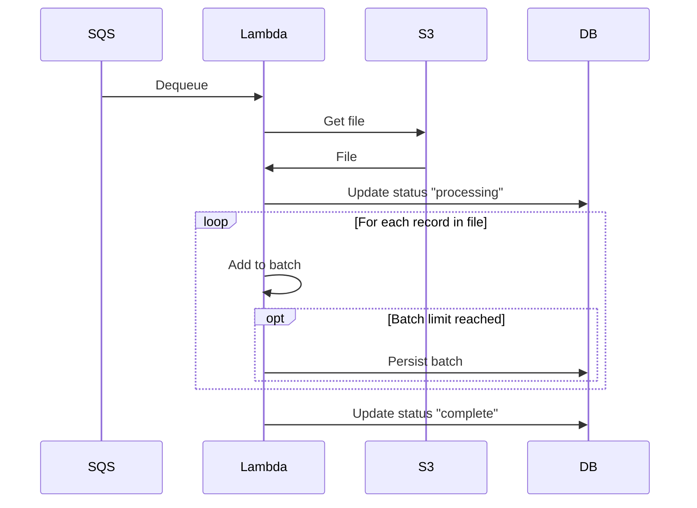
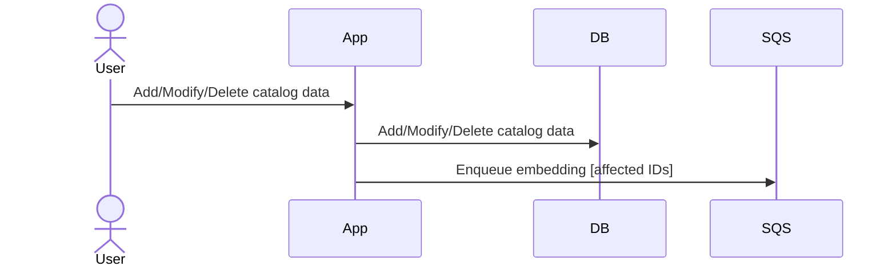
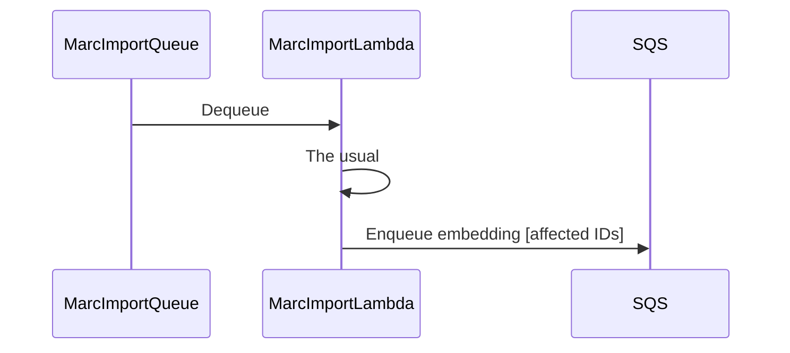
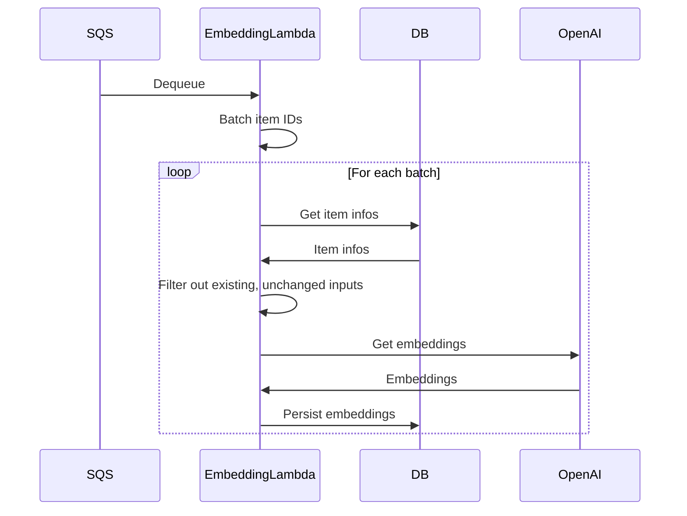
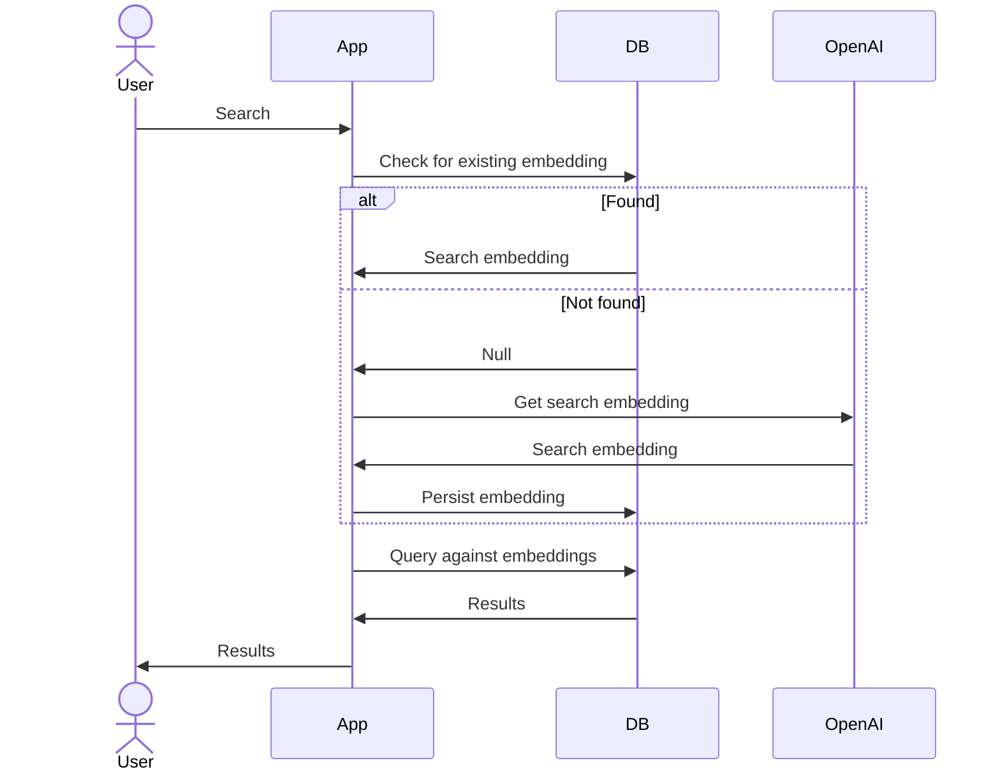

## MARC file processing

### 1/2

```mermaid
sequenceDiagram
   Client->>Server: This is the filename
   Server->>Server: Create signed URL
   Server->>Client: Signed URL
   Client->>S3: Upload
   S3->>Client: Success
   Client->>Server: Create record
   Server->>DB: Insert record "pending"
   Server->>SQS: Enqueue
   Server->>Client: Success
   Client->>Client: Go to Jobs view
```

### 2/2

```mermaid
sequenceDiagram
  SQS->>Lambda: Dequeue
  Lambda->>S3: Get file
  S3->>Lambda: File
  Lambda->>DB: Update status "processing"
  loop For each record in file
    Lambda->>Lambda: Add to batch
    opt Batch limit reached
      Lambda->>DB: Persist batch
    end
  end
  Lambda->>DB: Update status "complete"
```

## AI-powered Search Stuff

### On Add/Modify/Delete

```mermaid
sequenceDiagram
  actor User
  participant App
  participant DB
  participant SQS
  User->>App: Add/Modify/Delete catalog data
  App->>DB: Add/Modify/Delete catalog data
  App->>SQS: Enqueue embedding [affected IDs]
```

### On Import

```mermaid
sequenceDiagram
  MarcImportQueue->>MarcImportLambda: Dequeue
  MarcImportLambda->>MarcImportLambda: The usual
  MarcImportLambda->>SQS: Enqueue embedding [affected IDs]
```

### Collect embeddings

```mermaid
sequenceDiagram
  SQS->>EmbeddingLambda: Dequeue
  EmbeddingLambda->>EmbeddingLambda: Batch item IDs
  loop For each batch
    EmbeddingLambda->>DB: Get item infos
    DB->>EmbeddingLambda: Item infos
    EmbeddingLambda->>EmbeddingLambda: Filter out existing, unchanged inputs
    EmbeddingLambda->>OpenAI: Get embeddings
    OpenAI->>EmbeddingLambda: Embeddings
    EmbeddingLambda->>DB: Persist embeddings
  end
```

### Search

```mermaid
sequenceDiagram
  actor User
  participant App
  participant DB
  participant OpenAI
  User->>App: Search
  App->>DB: Check for existing embedding
  alt Found
    DB->>App: Search embedding
  else Not found
    DB->>App: Null
    App->>OpenAI: Get search embedding
    OpenAI->>App: Search embedding
    App->>DB: Persist embedding
  end
  App->>DB: Query against embeddings
  DB->>App: Results
  App->>User: Results
```
